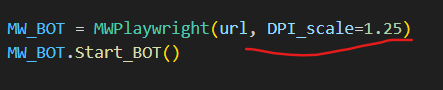

# How bot works?
Let's understand how actually bot works.

Firstly, you need to choose between 3 game modes. Then the browser and the website will open and start updateing cell/box data. As I said before it won't start solving before you click the first cell/box but when you do it will start solving.

## How it "updates" cell/box datas?
 We can get the website's DOM (Document Object Model) or what I like to say "Live HTML". As you can see at the bottom DOM can give us what we need but how?

Because we opened the browser with Playwright, we can get all DOM structure whenever we want and filter it to get what we want. But isn't there any better way to do that?

Well, yes. We can use the browser to get cell/box data we need. Because we use the browser we can use Javascript code to filter and get cell/box data and it is faster than getting *all* DOM then filtering it in Python. After we get filtered cell/box data we are going to process it in Python then feed it to other functions. 

### Note: You may have to check and change your DPI (Dots Per Inch) if it clicks wrong places.

You can find this in your display settings and you should change it as small number like:

200% = 2

125% = 1.25 

100% = 1
